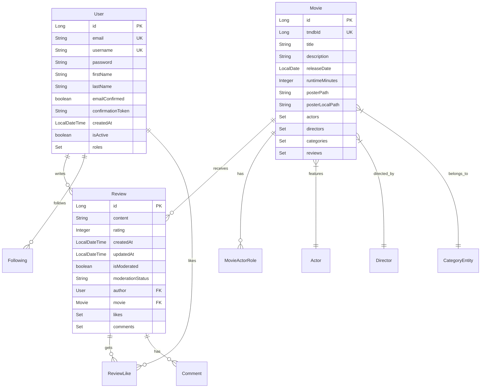
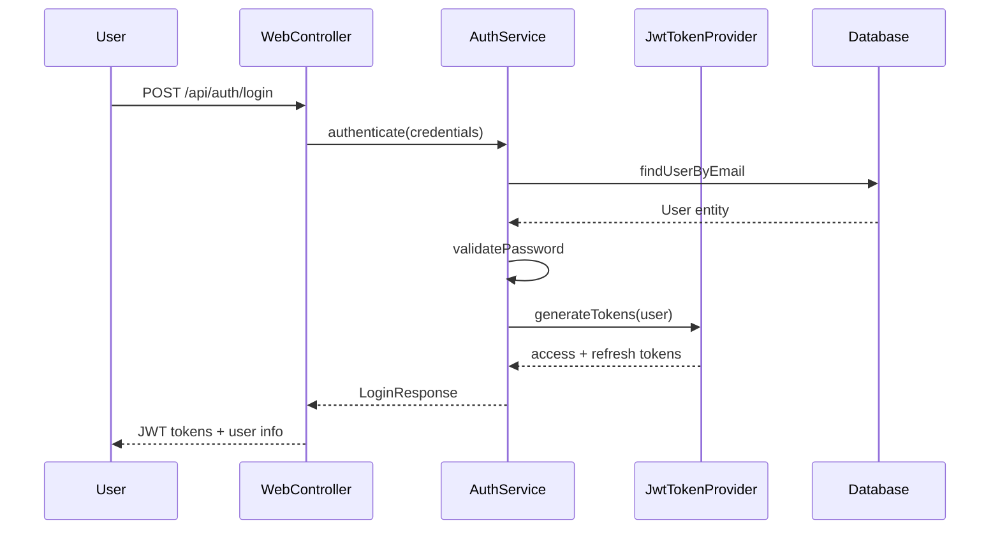

# 🏗️ Arquitectura del Sistema - PelisApp

Esta documentación describe la arquitectura, patrones de diseño y estructura técnica del proyecto PelisApp.

## 📐 Arquitectura General

### Patrón de Arquitectura
**PelisApp** sigue una **arquitectura en capas (Layered Architecture)** con separación clara de responsabilidades:

```
┌─────────────────────────────────────────────┐
│               CAPA DE PRESENTACIÓN           │
│  Controllers (REST API + Web Views)        │
├─────────────────────────────────────────────┤
│               CAPA DE APLICACIÓN             │
│  Services (Business Logic)                 │
├─────────────────────────────────────────────┤
│               CAPA DE DOMINIO               │
│  Entities + DTOs + Exceptions              │
├─────────────────────────────────────────────┤
│               CAPA DE PERSISTENCIA          │
│  Repositories (JPA) + Database             │
├─────────────────────────────────────────────┤
│               CAPA DE INFRAESTRUCTURA       │
│  External APIs (TMDB) + Email + Cache      │
└─────────────────────────────────────────────┘
```

### Principios Arquitectónicos

- **Separación de Responsabilidades**: Cada capa tiene una función específica
- **Inversión de Dependencias**: Uso de interfaces para desacoplar capas
- **Single Responsibility**: Cada clase tiene una responsabilidad única
- **Open/Closed**: Extensible sin modificar código existente
- **Dependency Injection**: Spring maneja todas las dependencias

## 📁 Estructura de Paquetes

### Organización Principal
```
src/main/java/alicanteweb/pelisapp/
├── 🚀 PelisAppApplication.java          # Punto de entrada Spring Boot
│
├── 🎮 controller/                       # Capa de Presentación
│   ├── WebController.java              # Vistas HTML (Thymeleaf)
│   ├── ApiController.java              # API REST pública
│   ├── AdminApiController.java         # API REST administrativa
│   ├── ImageController.java            # Servir imágenes estáticas
│   └── RestExceptionHandler.java       # Manejo global de excepciones
│
├── 🏢 service/                          # Capa de Aplicación (Lógica de Negocio)
│   ├── AuthService.java                # Autenticación y autorización
│   ├── MovieService.java               # Gestión de películas
│   ├── ReviewService.java              # Sistema de reseñas
│   ├── UserService.java                # Gestión de usuarios
│   ├── TMDBMovieLoaderService.java     # Importación desde TMDB
│   ├── TMDBBulkLoaderService.java      # Carga masiva TMDB
│   ├── ModerationService.java          # Moderación de contenido
│   ├── ModeratingAI.java               # Integración IA (Ollama)
│   ├── ImageStorageService.java        # Gestión de imágenes
│   ├── UserRegistrationService.java    # Registro de usuarios
│   ├── EmailConfirmationService.java   # Confirmación por email
│   ├── IEmailService.java              # Interface servicio email
│   ├── RealEmailService.java           # Implementación email real
│   └── MockEmailService.java           # Implementación email mock
│
├── 🎯 entity/                           # Capa de Dominio (Modelo de Datos)
│   ├── Movie.java                      # Película
│   ├── User.java                       # Usuario
│   ├── Review.java                     # Reseña
│   ├── Actor.java                      # Actor
│   ├── Director.java                   # Director
│   ├── CategoryEntity.java             # Categoría/Género
│   ├── Role.java                       # Rol de usuario
│   ├── Tag.java                        # Etiquetas
│   ├── Comment.java                    # Comentarios
│   ├── ReviewLike.java                 # Likes en reseñas
│   ├── Following.java                  # Seguimiento entre usuarios
│   └── Archivement.java                # Sistema de logros
│
├── 📦 dto/                              # Data Transfer Objects
│   ├── MovieDetailsDTO.java            # Detalles completos película
│   ├── MovieListDTO.java               # Lista resumida películas
│   ├── CastDTO.java                    # Información reparto
│   ├── CrewDTO.java                    # Información equipo técnico
│   ├── UserDTO.java                    # Información usuario
│   ├── LoginRequest.java               # Request autenticación
│   ├── LoginResponse.java              # Response autenticación
│   ├── RegisterRequest.java            # Request registro
│   └── ReviewCreateRequest.java        # Request crear reseña
│
├── 📊 repository/                       # Capa de Persistencia
│   ├── MovieRepository.java            # Repositorio películas
│   ├── UserRepository.java             # Repositorio usuarios
│   ├── ReviewRepository.java           # Repositorio reseñas
│   ├── ActorRepository.java            # Repositorio actores
│   ├── CategoryRepository.java         # Repositorio categorías
│   └── ...                             # Otros repositorios
│
├── 🔐 security/                         # Configuración de Seguridad
│   ├── SecurityConfig.java             # Configuración Spring Security
│   ├── JwtTokenProvider.java           # Generación/validación JWT
│   ├── JwtAuthenticationFilter.java    # Filtro autenticación JWT
│   ├── CustomUserDetailsService.java   # Servicio detalles usuario
│   ├── CustomAuthenticationSuccessHandler.java
│   └── CustomAuthenticationFailureHandler.java
│
├── ⚙️ config/                           # Configuración de Spring
│   ├── DataInitializer.java            # Inicialización datos
│   ├── DatabaseStartupCheck.java       # Verificación BD al inicio
│   ├── EmailConfig.java                # Configuración email
│   ├── WebConfig.java                  # Configuración web general
│   └── CommonConfig.java               # Configuración común
│
├── 🌐 tmdb/                             # Integración TMDB
│   ├── TMDBClient.java                 # Cliente HTTP para TMDB API
│   └── TMDBConfig.java                 # Configuración TMDB
│
├── 🚨 exception/                        # Manejo de Excepciones
│   ├── GlobalExceptionHandler.java     # Handler global excepciones
│   ├── ResourceNotFoundException.java  # Excepción recurso no encontrado
│   ├── ValidationErrorResponse.java    # Response errores validación
│   └── ErrorResponse.java              # Response genérico error
│
├── 🛠️ util/                             # Utilidades
│   ├── PasswordGenerator.java          # Generador contraseñas
│   └── PasswordHashGenerator.java      # Hash contraseñas
│
└── 📊 constants/                        # Constantes
    ├── AppConstants.java               # Constantes aplicación
    ├── RoleConstants.java              # Constantes roles
    └── ValidationConstants.java        # Constantes validación
```

## 🎮 Patrón de Controladores Unificados

### Arquitectura Anterior vs Nueva

#### ❌ Arquitectura Anterior (16+ Controladores)
```
HomeController.java
LoginController.java
RegisterController.java
MovieController.java
ReviewController.java
AuthController.java
AdminController.java
PerfilController.java
TMDBLoadController.java
ModerationController.java
CastController.java
HealthController.java
EmailTestController.java
DebugController.java
AdminUserController.java
...
```

#### ✅ Arquitectura Actual (3 Controladores Principales)

**1. WebController.java** - Todas las vistas HTML
```java
@Controller
public class WebController {
    // GET  /                    - Página principal
    // GET  /pelicula/{id}       - Detalle película  
    // GET  /login              - Login
    // GET  /register           - Registro
    // GET  /perfil             - Perfil usuario
    // GET  /admin              - Panel admin
}
```

**2. ApiController.java** - API REST pública
```java
@RestController
@RequestMapping("/api")
public class ApiController {
    // GET  /api/movies/{id}/details    - Detalles película
    // POST /api/reviews               - Crear reseña
    // POST /api/auth/login            - Autenticación
    // GET  /api/health                - Health check
}
```

**3. AdminApiController.java** - API REST administrativa
```java
@RestController
@RequestMapping("/api/admin")
public class AdminApiController {
    // POST /api/admin/tmdb/load-movie/{id}    - Cargar película
    // GET  /api/admin/users                   - Gestión usuarios
    // POST /api/admin/moderation/review       - Moderación
    // GET  /api/admin/debug/database          - Debug BD
}
```

### Ventajas del Patrón Unificado

1. **📉 Reducción de Archivos**: De 16+ a 3 controladores principales
2. **🔍 Separación Clara**: Web/API Pública/API Admin
3. **🎯 Responsabilidad Única**: Cada controlador tiene un propósito específico
4. **🚀 Mantenimiento Fácil**: Menos archivos que mantener
5. **📍 Rutas Organizadas**: Agrupación lógica de endpoints

## 🗄️ Modelo de Datos

### Entidades Principales



### Relaciones Principales

| Entidad A | Relación | Entidad B | Cardinalidad | Descripción |
|-----------|----------|-----------|--------------|-------------|
| User | writes | Review | 1:N | Un usuario puede escribir muchas reseñas |
| Movie | receives | Review | 1:N | Una película puede recibir muchas reseñas |
| User | likes | Review | N:M | Usuarios pueden dar like a reseñas |
| User | follows | User | N:M | Sistema de seguimiento entre usuarios |
| Movie | features | Actor | N:M | Películas tienen muchos actores |
| Movie | directed_by | Director | N:M | Películas pueden tener varios directores |
| Movie | belongs_to | Category | N:M | Películas pertenecen a múltiples géneros |

## 🔐 Arquitectura de Seguridad

### Flujo de Autenticación JWT



### Configuración de Seguridad

```java
@Configuration
@EnableWebSecurity
public class SecurityConfig {
    
    // Configuración de filtros
    @Bean
    public SecurityFilterChain filterChain(HttpSecurity http) {
        return http
            .addFilterBefore(jwtAuthenticationFilter, 
                           UsernamePasswordAuthenticationFilter.class)
            .authorizeHttpRequests(auth -> auth
                .requestMatchers("/api/admin/**").hasRole("ADMIN")
                .requestMatchers("/api/auth/**").permitAll()
                .requestMatchers("/api/movies/**").permitAll()
            )
            .build();
    }
}
```

### Roles y Permisos

| Rol | Permisos | Endpoints Accesibles |
|-----|----------|-------------------|
| **GUEST** | Solo lectura | `/api/movies/**`, `/api/health` |
| **USER** | Lectura + escribir reseñas | `/api/reviews/**`, `/perfil` |
| **MODERATOR** | USER + moderar contenido | `/api/admin/moderation/**` |
| **ADMIN** | Todos los permisos | `/api/admin/**`, gestión completa |

## 🔌 Integraciones Externas

### TMDB (The Movie Database)

```java
@Component
public class TMDBClient {
    
    @Value("${app.tmdb.bearer-token}")
    private String bearerToken;
    
    public Mono<TMDBMovieResponse> getMovieDetails(Long movieId) {
        return webClient
            .get()
            .uri("/movie/{id}", movieId)
            .header("Authorization", "Bearer " + bearerToken)
            .retrieve()
            .bodyToMono(TMDBMovieResponse.class);
    }
}
```

### Ollama (IA para Moderación)

```java
@Service
public class ModeratingAI {
    
    public CompletableFuture<ModerationResult> moderateContent(String content) {
        return CompletableFuture.supplyAsync(() -> {
            // Llamada a Ollama API para análisis de toxicidad
            return ollamaClient.analyzeContent(content);
        });
    }
}
```

### Sistema de Email

```java
public interface IEmailService {
    void sendConfirmationEmail(User user, String token);
    void sendPasswordResetEmail(User user, String token);
    void sendNotificationEmail(User user, String subject, String content);
}
```

## 📦 Gestión de Dependencias

### Dependencies Principales
```xml
<dependencies>
    <!-- Spring Boot Starters -->
    <dependency>
        <groupId>org.springframework.boot</groupId>
        <artifactId>spring-boot-starter-web</artifactId>
    </dependency>
    <dependency>
        <groupId>org.springframework.boot</groupId>
        <artifactId>spring-boot-starter-data-jpa</artifactId>
    </dependency>
    <dependency>
        <groupId>org.springframework.boot</groupId>
        <artifactId>spring-boot-starter-security</artifactId>
    </dependency>
    
    <!-- JWT -->
    <dependency>
        <groupId>io.jsonwebtoken</groupId>
        <artifactId>jjwt-api</artifactId>
    </dependency>
    
    <!-- Database -->
    <dependency>
        <groupId>com.mysql</groupId>
        <artifactId>mysql-connector-j</artifactId>
    </dependency>
    
    <!-- Utilities -->
    <dependency>
        <groupId>org.projectlombok</groupId>
        <artifactId>lombok</artifactId>
    </dependency>
</dependencies>
```

## 🚀 Configuraciones por Ambiente

### Perfiles Spring

#### Desarrollo (`application-dev.properties`)
```properties
# Base de datos local
spring.datasource.url=jdbc:mysql://localhost:3306/pelisapp_dev

# Debug habilitado
spring.jpa.show-sql=true
logging.level.alicanteweb.pelisapp=DEBUG

# Carga automática TMDB deshabilitada
app.tmdb.load-on-startup=false

# Mock email service
app.email.enabled=false
```

#### Producción (`application-prod.properties`)
```properties
# Base de datos de producción
spring.datasource.url=${DATABASE_URL}

# Logs optimizados
spring.jpa.show-sql=false
logging.level.root=WARN

# Seguridad reforzada
app.jwt.secret=${JWT_SECRET_PRODUCTION}

# Email real habilitado
app.email.enabled=true
```

## 📊 Cache y Rendimiento

### Configuración de Cache
```java
@Configuration
@EnableCaching
public class CacheConfig {
    
    @Bean
    public CacheManager cacheManager() {
        CaffeineCacheManager cacheManager = new CaffeineCacheManager();
        cacheManager.setCaffeine(Caffeine.newBuilder()
            .maximumSize(1000)
            .expireAfterWrite(30, TimeUnit.MINUTES)
        );
        return cacheManager;
    }
}
```

### Estrategias de Cache
- **Movies**: Cache de detalles de películas (30min)
- **TMDB API**: Cache de respuestas TMDB (1 hora)
- **User Sessions**: Cache de información de usuario (15min)
- **Static Data**: Cache de categorías y roles (Sin expiración)

## 🔍 Monitoreo y Observabilidad

### Health Checks
```java
@RestController
public class HealthController {
    
    @GetMapping("/api/health")
    public ResponseEntity<Map<String, Object>> health() {
        return ResponseEntity.ok(Map.of(
            "status", "UP",
            "timestamp", Instant.now(),
            "version", getClass().getPackage().getImplementationVersion()
        ));
    }
}
```

### Logging Strategy
- **DEBUG**: Desarrollo y troubleshooting
- **INFO**: Eventos importantes (login, registro, etc.)
- **WARN**: Problemas no críticos (TMDB API failures)
- **ERROR**: Errores críticos que requieren atención

---

Esta arquitectura está diseñada para ser **escalable**, **mantenible** y **extensible**, siguiendo las mejores prácticas de desarrollo con Spring Boot y patrones de diseño reconocidos en la industria.
