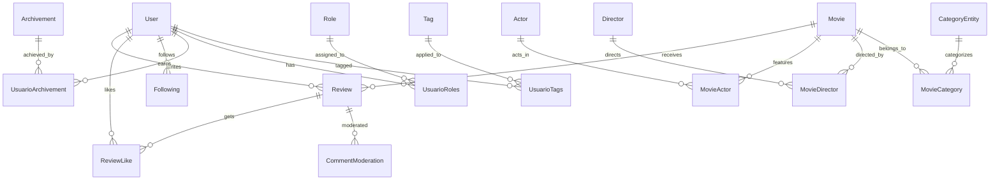

# 🗄️ Documentación de Base de Datos - PelisApp

Esta documentación describe el modelo de datos, esquema de base de datos y estructura relacional de PelisApp.

## 📊 Visión General

PelisApp utiliza **MySQL 8.0+** como base de datos relacional con **JPA/Hibernate** para el mapeo objeto-relacional. El diseño sigue principios de normalización y optimización para consultas eficientes.

### Características del Esquema
- **Normalización 3NF**: Evita redundancia de datos
- **Índices estratégicos**: Optimización para consultas frecuentes
- **Relaciones bien definidas**: Foreign keys y constraints
- **Campos de auditoría**: timestamps para tracking de cambios
- **Soft deletes**: Para preservar integridad referencial

## 🏗️ Diagrama de Entidades Principales



## 📋 Tablas Principales

### 🎭 Usuario (User)
Almacena información de usuarios del sistema.

**Tabla:** `usuario`

| Campo | Tipo | Restricciones | Descripción |
|-------|------|---------------|-------------|
| `id` | BIGINT | PK, AUTO_INCREMENT | Identificador único |
| `username` | VARCHAR(100) | UNIQUE, NOT NULL, INDEX | Nombre de usuario único |
| `email` | VARCHAR(200) | UNIQUE, INDEX | Email del usuario |
| `password` | VARCHAR(255) | NOT NULL | Hash de contraseña |
| `display_name` | VARCHAR(150) | | Nombre para mostrar |
| `registered_at` | TIMESTAMP | | Fecha de registro |
| `email_confirmed` | BOOLEAN | NOT NULL, DEFAULT FALSE | Email confirmado |
| `banned` | BOOLEAN | NOT NULL, DEFAULT FALSE | Usuario baneado |
| `critic_level` | INT | DEFAULT 0 | Nivel de crítico (calculado) |

```sql
CREATE TABLE usuario (
    id BIGINT AUTO_INCREMENT PRIMARY KEY,
    username VARCHAR(100) UNIQUE NOT NULL,
    email VARCHAR(200) UNIQUE,
    password VARCHAR(255) NOT NULL,
    display_name VARCHAR(150),
    registered_at TIMESTAMP DEFAULT CURRENT_TIMESTAMP,
    email_confirmed BOOLEAN NOT NULL DEFAULT FALSE,
    banned BOOLEAN NOT NULL DEFAULT FALSE,
    critic_level INT DEFAULT 0,
    
    INDEX idx_username (username),
    INDEX idx_email (email)
);
```

### 🎬 Película (Movie)
Información completa de películas.

**Tabla:** `movie`

| Campo | Tipo | Restricciones | Descripción |
|-------|------|---------------|-------------|
| `id` | BIGINT | PK, AUTO_INCREMENT | Identificador único interno |
| `tmdb_id` | BIGINT | UNIQUE | ID de TMDB (externo) |
| `title` | VARCHAR(500) | NOT NULL, INDEX | Título de la película |
| `description` | TEXT(2000) | | Sinopsis |
| `release_date` | DATE | | Fecha de estreno |
| `runtime_minutes` | INT | | Duración en minutos |
| `poster_path` | VARCHAR(500) | | URL del poster (TMDB) |
| `poster_local_path` | VARCHAR(500) | | Ruta local del poster |

```sql
CREATE TABLE movie (
    id BIGINT AUTO_INCREMENT PRIMARY KEY,
    tmdb_id BIGINT UNIQUE,
    title VARCHAR(500) NOT NULL,
    description TEXT(2000),
    release_date DATE,
    runtime_minutes INT,
    poster_path VARCHAR(500),
    poster_local_path VARCHAR(500),
    
    INDEX idx_title (title),
    INDEX idx_tmdb_id (tmdb_id),
    INDEX idx_release_date (release_date)
);
```

### ⭐ Reseña (Review)
Reseñas y valoraciones de usuarios sobre películas.

**Tabla:** `review`

| Campo | Tipo | Restricciones | Descripción |
|-------|------|---------------|-------------|
| `id` | BIGINT | PK, AUTO_INCREMENT | Identificador único |
| `user_id` | BIGINT | FK, NOT NULL, INDEX | Usuario que escribe |
| `movie_id` | BIGINT | FK, NOT NULL, INDEX | Película reseñada |
| `text` | TEXT(2000) | NOT NULL | Contenido de la reseña |
| `stars` | INT | NOT NULL, CHECK (1-10) | Valoración numérica |
| `created_at` | TIMESTAMP | DEFAULT NOW() | Fecha de creación |
| `updated_at` | TIMESTAMP | ON UPDATE NOW() | Última modificación |
| `likes_count` | BIGINT | DEFAULT 0 | Contador de likes |

```sql
CREATE TABLE review (
    id BIGINT AUTO_INCREMENT PRIMARY KEY,
    user_id BIGINT NOT NULL,
    movie_id BIGINT NOT NULL,
    text TEXT(2000) NOT NULL,
    stars INT NOT NULL CHECK (stars BETWEEN 1 AND 10),
    created_at TIMESTAMP DEFAULT CURRENT_TIMESTAMP,
    updated_at TIMESTAMP DEFAULT CURRENT_TIMESTAMP ON UPDATE CURRENT_TIMESTAMP,
    likes_count BIGINT DEFAULT 0,
    
    FOREIGN KEY (user_id) REFERENCES usuario(id) ON DELETE CASCADE,
    FOREIGN KEY (movie_id) REFERENCES movie(id) ON DELETE CASCADE,
    
    INDEX idx_user_id (user_id),
    INDEX idx_movie_id (movie_id),
    INDEX idx_created_at (created_at),
    
    UNIQUE KEY unique_user_movie (user_id, movie_id)
);
```

### 👤 Actor
Información de actores.

**Tabla:** `actor`

| Campo | Tipo | Restricciones | Descripción |
|-------|------|---------------|-------------|
| `id` | BIGINT | PK, AUTO_INCREMENT | Identificador único |
| `tmdb_id` | BIGINT | UNIQUE | ID de TMDB |
| `name` | VARCHAR(200) | NOT NULL, INDEX | Nombre del actor |
| `profile_path` | VARCHAR(500) | | URL imagen perfil |
| `profile_local_path` | VARCHAR(500) | | Ruta local imagen |

```sql
CREATE TABLE actor (
    id BIGINT AUTO_INCREMENT PRIMARY KEY,
    tmdb_id BIGINT UNIQUE,
    name VARCHAR(200) NOT NULL,
    profile_path VARCHAR(500),
    profile_local_path VARCHAR(500),
    
    INDEX idx_name (name),
    INDEX idx_tmdb_id (tmdb_id)
);
```

### 🎭 Director
Información de directores.

**Tabla:** `director`

| Campo | Tipo | Restricciones | Descripción |
|-------|------|---------------|-------------|
| `id` | BIGINT | PK, AUTO_INCREMENT | Identificador único |
| `tmdb_id` | BIGINT | UNIQUE | ID de TMDB |
| `name` | VARCHAR(200) | NOT NULL, INDEX | Nombre del director |

```sql
CREATE TABLE director (
    id BIGINT AUTO_INCREMENT PRIMARY KEY,
    tmdb_id BIGINT UNIQUE,
    name VARCHAR(200) NOT NULL,
    
    INDEX idx_name (name)
);
```

## 🔗 Tablas de Relaciones

### 🎬👤 Película-Actor (movie_actor)
Relación many-to-many entre películas y actores.

```sql
CREATE TABLE movie_actor (
    id BIGINT AUTO_INCREMENT PRIMARY KEY,
    movie_id BIGINT NOT NULL,
    actor_id BIGINT NOT NULL,
    character_name VARCHAR(300),
    cast_order INT,
    
    FOREIGN KEY (movie_id) REFERENCES movie(id) ON DELETE CASCADE,
    FOREIGN KEY (actor_id) REFERENCES actor(id) ON DELETE CASCADE,
    
    UNIQUE KEY unique_movie_actor (movie_id, actor_id)
);
```

### 🎬🎭 Película-Director (movie_director)
Relación many-to-many entre películas y directores.

```sql
CREATE TABLE movie_director (
    movie_id BIGINT NOT NULL,
    director_id BIGINT NOT NULL,
    
    PRIMARY KEY (movie_id, director_id),
    FOREIGN KEY (movie_id) REFERENCES movie(id) ON DELETE CASCADE,
    FOREIGN KEY (director_id) REFERENCES director(id) ON DELETE CASCADE
);
```

### ❤️ Likes en Reseñas (review_like)
Sistema de likes para reseñas.

```sql
CREATE TABLE review_like (
    id BIGINT AUTO_INCREMENT PRIMARY KEY,
    user_id BIGINT NOT NULL,
    review_id BIGINT NOT NULL,
    created_at TIMESTAMP DEFAULT CURRENT_TIMESTAMP,
    
    FOREIGN KEY (user_id) REFERENCES usuario(id) ON DELETE CASCADE,
    FOREIGN KEY (review_id) REFERENCES review(id) ON DELETE CASCADE,
    
    UNIQUE KEY unique_user_review (user_id, review_id),
    INDEX idx_review_id (review_id)
);
```

### 👥 Seguimiento de Usuarios (following)
Sistema de seguimiento entre usuarios.

```sql
CREATE TABLE following (
    id BIGINT AUTO_INCREMENT PRIMARY KEY,
    follower_id BIGINT NOT NULL,
    followed_id BIGINT NOT NULL,
    created_at TIMESTAMP DEFAULT CURRENT_TIMESTAMP,
    
    FOREIGN KEY (follower_id) REFERENCES usuario(id) ON DELETE CASCADE,
    FOREIGN KEY (followed_id) REFERENCES usuario(id) ON DELETE CASCADE,
    
    UNIQUE KEY unique_following (follower_id, followed_id),
    CHECK (follower_id != followed_id)
);
```

## 🔐 Sistema de Roles y Permisos

### 🛡️ Roles (role)
Roles del sistema.

```sql
CREATE TABLE role (
    id BIGINT AUTO_INCREMENT PRIMARY KEY,
    name VARCHAR(50) UNIQUE NOT NULL,
    description VARCHAR(200)
);

-- Datos iniciales
INSERT INTO role (name, description) VALUES 
('USER', 'Usuario básico del sistema'),
('MODERATOR', 'Moderador de contenido'),
('ADMIN', 'Administrador del sistema');
```

### 👤🛡️ Usuario-Roles (usuario_roles)
Asignación de roles a usuarios.

```sql
CREATE TABLE usuario_roles (
    usuario_id BIGINT NOT NULL,
    role_id BIGINT NOT NULL,
    
    PRIMARY KEY (usuario_id, role_id),
    FOREIGN KEY (usuario_id) REFERENCES usuario(id) ON DELETE CASCADE,
    FOREIGN KEY (role_id) REFERENCES role(id) ON DELETE CASCADE
);
```

### 🏷️ Etiquetas (tag)
Sistema de etiquetas/badges para usuarios.

```sql
CREATE TABLE tag (
    id BIGINT AUTO_INCREMENT PRIMARY KEY,
    name VARCHAR(50) UNIQUE NOT NULL,
    description VARCHAR(200),
    color VARCHAR(7) DEFAULT '#007bff'
);
```

### 👤🏷️ Usuario-Etiquetas (usuario_etiquetas)
Asignación de etiquetas a usuarios.

```sql
CREATE TABLE usuario_etiquetas (
    usuario_id BIGINT NOT NULL,
    etiqueta_id BIGINT NOT NULL,
    assigned_at TIMESTAMP DEFAULT CURRENT_TIMESTAMP,
    
    PRIMARY KEY (usuario_id, etiqueta_id),
    FOREIGN KEY (usuario_id) REFERENCES usuario(id) ON DELETE CASCADE,
    FOREIGN KEY (etiqueta_id) REFERENCES tag(id) ON DELETE CASCADE
);
```

## 🏆 Sistema de Logros

### 🏆 Logros (archivement)
Definición de logros del sistema.

```sql
CREATE TABLE archivement (
    id BIGINT AUTO_INCREMENT PRIMARY KEY,
    name VARCHAR(100) NOT NULL,
    description VARCHAR(300),
    icon VARCHAR(50),
    required_value INT DEFAULT 1,
    type ENUM('REVIEW_COUNT', 'LIKE_COUNT', 'MOVIE_COUNT', 'SPECIAL') DEFAULT 'SPECIAL'
);
```

### 👤🏆 Usuario-Logros (usuario_archivement)
Logros obtenidos por usuarios.

```sql
CREATE TABLE usuario_archivement (
    id BIGINT AUTO_INCREMENT PRIMARY KEY,
    user_id BIGINT NOT NULL,
    archivement_id BIGINT NOT NULL,
    achieved_at TIMESTAMP DEFAULT CURRENT_TIMESTAMP,
    current_progress INT DEFAULT 0,
    
    FOREIGN KEY (user_id) REFERENCES usuario(id) ON DELETE CASCADE,
    FOREIGN KEY (archivement_id) REFERENCES archivement(id) ON DELETE CASCADE,
    
    UNIQUE KEY unique_user_archivement (user_id, archivement_id)
);
```

## 🛡️ Sistema de Moderación

### 🔍 Moderación de Comentarios (comment_moderation)
Registro de moderación de contenido.

```sql
CREATE TABLE comment_moderation (
    id BIGINT AUTO_INCREMENT PRIMARY KEY,
    review_id BIGINT UNIQUE NOT NULL,
    ai_toxicity_score DECIMAL(3,2),
    ai_recommendation VARCHAR(20),
    manual_status VARCHAR(20),
    moderator_notes TEXT(500),
    created_at TIMESTAMP DEFAULT CURRENT_TIMESTAMP,
    reviewed_at TIMESTAMP,
    
    FOREIGN KEY (review_id) REFERENCES review(id) ON DELETE CASCADE,
    
    INDEX idx_ai_toxicity_score (ai_toxicity_score),
    INDEX idx_manual_status (manual_status)
);
```

## 📊 Categorías y Géneros

### 🎭 Categorías (category_entity)
Géneros y categorías de películas.

```sql
CREATE TABLE category_entity (
    id BIGINT AUTO_INCREMENT PRIMARY KEY,
    tmdb_id INT UNIQUE,
    name VARCHAR(100) NOT NULL,
    description VARCHAR(300)
);
```

### 🎬🎭 Película-Categoría (movie_category)
Relación many-to-many entre películas y categorías.

```sql
CREATE TABLE movie_category (
    movie_id BIGINT NOT NULL,
    category_id BIGINT NOT NULL,
    
    PRIMARY KEY (movie_id, category_id),
    FOREIGN KEY (movie_id) REFERENCES movie(id) ON DELETE CASCADE,
    FOREIGN KEY (category_id) REFERENCES category_entity(id) ON DELETE CASCADE
);
```

## 🌍 Información Geográfica

### 🗺️ Países (country)
Información de países para películas.

```sql
CREATE TABLE country (
    id BIGINT AUTO_INCREMENT PRIMARY KEY,
    iso_code VARCHAR(2) UNIQUE NOT NULL,
    name VARCHAR(100) NOT NULL
);
```

## 🔍 Índices Estratégicos

### Índices Principales
```sql
-- Búsquedas de películas
CREATE INDEX idx_movie_title_fulltext ON movie (title);
CREATE INDEX idx_movie_release_year ON movie (YEAR(release_date));

-- Consultas de reseñas
CREATE INDEX idx_review_rating ON review (stars);
CREATE INDEX idx_review_user_movie ON review (user_id, movie_id);
CREATE INDEX idx_review_movie_created ON review (movie_id, created_at DESC);

-- Búsquedas de usuarios
CREATE INDEX idx_user_email_confirmed ON usuario (email_confirmed);
CREATE INDEX idx_user_critic_level ON usuario (critic_level DESC);

-- Moderación y administración
CREATE INDEX idx_moderation_status ON comment_moderation (manual_status, ai_toxicity_score);
CREATE INDEX idx_moderation_pending ON comment_moderation (manual_status, created_at) 
    WHERE manual_status IS NULL;
```

### Índices Compuestos
```sql
-- Para dashboard de administración
CREATE INDEX idx_admin_user_stats ON usuario (banned, email_confirmed, registered_at);

-- Para estadísticas de películas
CREATE INDEX idx_movie_stats ON review (movie_id, stars, created_at);

-- Para timeline de actividad
CREATE INDEX idx_activity_timeline ON review (user_id, created_at DESC);
```

## 📊 Vistas Útiles

### Vista: Estadísticas de Película
```sql
CREATE VIEW movie_stats AS
SELECT 
    m.id,
    m.title,
    m.release_date,
    COUNT(r.id) as review_count,
    AVG(r.stars) as average_rating,
    MIN(r.stars) as min_rating,
    MAX(r.stars) as max_rating,
    SUM(r.likes_count) as total_likes
FROM movie m
LEFT JOIN review r ON m.id = r.movie_id
GROUP BY m.id, m.title, m.release_date;
```

### Vista: Estadísticas de Usuario
```sql
CREATE VIEW user_stats AS
SELECT 
    u.id,
    u.username,
    u.registered_at,
    COUNT(r.id) as review_count,
    AVG(r.stars) as avg_rating_given,
    SUM(r.likes_count) as total_likes_received,
    u.critic_level
FROM usuario u
LEFT JOIN review r ON u.id = r.user_id
GROUP BY u.id, u.username, u.registered_at, u.critic_level;
```

## 🔧 Procedimientos Almacenados

### Actualizar Nivel de Crítico
```sql
DELIMITER //
CREATE PROCEDURE UpdateCriticLevels()
BEGIN
    UPDATE usuario u
    SET critic_level = (
        SELECT COALESCE(
            CASE 
                WHEN AVG(r.likes_count) >= 10 THEN 5
                WHEN AVG(r.likes_count) >= 5 THEN 4
                WHEN AVG(r.likes_count) >= 2 THEN 3
                WHEN COUNT(r.id) >= 10 THEN 2
                WHEN COUNT(r.id) >= 5 THEN 1
                ELSE 0
            END, 0
        )
        FROM review r 
        WHERE r.user_id = u.id
    );
END //
DELIMITER ;
```

### Limpiar Datos Temporales
```sql
DELIMITER //
CREATE PROCEDURE CleanupOldData()
BEGIN
    -- Eliminar tokens de confirmación expirados (más de 24 horas)
    DELETE FROM usuario 
    WHERE email_confirmed = FALSE 
    AND registered_at < DATE_SUB(NOW(), INTERVAL 24 HOUR);
    
    -- Limpiar logs de moderación antiguos (más de 6 meses)
    DELETE FROM comment_moderation 
    WHERE created_at < DATE_SUB(NOW(), INTERVAL 6 MONTH)
    AND manual_status IS NOT NULL;
END //
DELIMITER ;
```

## 🔄 Migraciones y Versionado

### Script de Inicialización
```sql
-- Version 1.0.0 - Initial Schema
-- scripts/V1.0.0__Initial_Schema.sql

-- Crear base de datos
CREATE DATABASE IF NOT EXISTS pelisapp 
    CHARACTER SET utf8mb4 
    COLLATE utf8mb4_unicode_ci;

USE pelisapp;

-- Crear todas las tablas
-- (Incluir todas las definiciones de CREATE TABLE anteriores)

-- Insertar datos iniciales
INSERT INTO role (name, description) VALUES 
('USER', 'Usuario básico del sistema'),
('MODERATOR', 'Moderador de contenido'),
('ADMIN', 'Administrador del sistema');
```

### Control de Versiones
```sql
-- Tabla de control de migraciones
CREATE TABLE schema_version (
    version VARCHAR(20) PRIMARY KEY,
    description VARCHAR(200),
    applied_at TIMESTAMP DEFAULT CURRENT_TIMESTAMP
);

INSERT INTO schema_version (version, description) VALUES 
('1.0.0', 'Initial schema creation');
```

## 📈 Optimizaciones de Rendimiento

### Configuración MySQL Recomendada
```ini
# my.cnf optimizado para PelisApp
[mysqld]
# InnoDB settings
innodb_buffer_pool_size = 1G
innodb_log_file_size = 256M
innodb_flush_log_at_trx_commit = 2
innodb_file_per_table = 1

# Query cache (deprecated en MySQL 8.0+)
# Use application-level caching instead

# General settings
max_connections = 100
slow_query_log = 1
long_query_time = 2
```

### Queries Optimizadas de Ejemplo

#### Top Películas por Rating
```sql
SELECT 
    m.title,
    m.release_date,
    ROUND(AVG(r.stars), 2) as avg_rating,
    COUNT(r.id) as review_count
FROM movie m
INNER JOIN review r ON m.id = r.movie_id
GROUP BY m.id, m.title, m.release_date
HAVING COUNT(r.id) >= 5
ORDER BY avg_rating DESC, review_count DESC
LIMIT 20;
```

#### Usuarios Más Activos
```sql
SELECT 
    u.username,
    u.display_name,
    COUNT(r.id) as review_count,
    SUM(r.likes_count) as total_likes,
    u.critic_level
FROM usuario u
INNER JOIN review r ON u.id = r.user_id
WHERE u.banned = FALSE
GROUP BY u.id, u.username, u.display_name, u.critic_level
ORDER BY review_count DESC, total_likes DESC
LIMIT 50;
```

## 🛠️ Scripts de Mantenimiento

Ver directorio `/scripts/` para:
- `create-admin-user.sql` - Crear usuario administrador
- `delete-all-users.sql` - Limpiar datos de desarrollo
- `backup-database.sh` - Script de backup
- `optimize-tables.sql` - Optimización periódica

---

Este modelo de datos está diseñado para ser **escalable**, **eficiente** y **mantenible**, proporcionando una base sólida para todas las funcionalidades de PelisApp.
