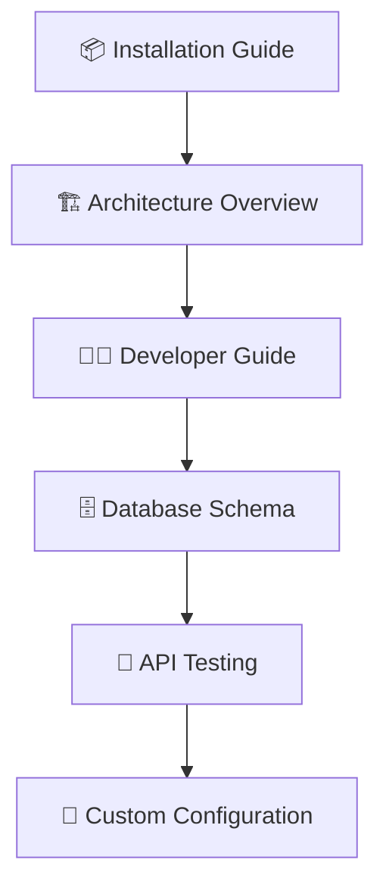
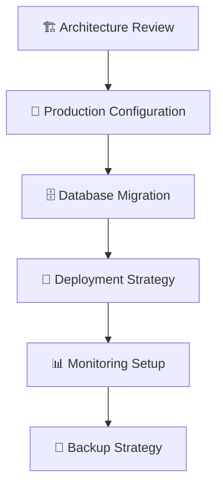

# 📚 Índice de Documentación - PelisApp

Bienvenido al centro de documentación técnica completa de PelisApp. Aquí encontrarás toda la información necesaria para entender, desarrollar, configurar y desplegar la aplicación.

## 🚀 Inicio Rápido

### Para Usuarios Nuevos
1. **[README Principal](../README.md)** - Visión general del proyecto y características
2. **[Guía de Instalación](INSTALLATION.md)** - Setup paso a paso para desarrollo
3. **[Documentación de API](API.md)** - Endpoints y ejemplos de uso

### Para Desarrolladores
1. **[Guía para Desarrolladores](DEVELOPER.md)** - Estándares, patrones y mejores prácticas
2. **[Arquitectura del Sistema](ARCHITECTURE.md)** - Estructura técnica y diseño
3. **[Base de Datos](DATABASE.md)** - Modelo de datos y esquemas

### Para DevOps/Administradores
1. **[Configuración](CONFIGURATION.md)** - Variables de entorno y configuración
2. **[Deployment](DEPLOYMENT.md)** - Guías de despliegue y producción

---

## 📖 Documentación Completa

### 🏗️ [Arquitectura del Sistema](ARCHITECTURE.md)
**Descripción:** Arquitectura técnica completa del proyecto
- Patrones arquitectónicos (Layered Architecture)
- Estructura de paquetes y organización del código
- Controladores unificados (WebController, ApiController, AdminApiController)
- Modelo de datos y relaciones entre entidades
- Configuración de seguridad y autenticación JWT
- Integraciones externas (TMDB, Ollama, Email)
- Estrategias de cache y rendimiento

**Ideal para:** Desarrolladores senior, arquitectos de software, nuevos miembros del equipo

---

### 🔌 [Documentación de API](API.md)
**Descripción:** Referencia completa de todos los endpoints REST
- **API Pública (`/api`)**: Películas, reseñas, autenticación
  - GET `/api/movies` - Lista de películas
  - GET `/api/movies/{id}/details` - Detalles de película
  - POST `/api/reviews` - Crear reseña
  - POST `/api/auth/login` - Autenticación
  - POST `/api/auth/register` - Registro de usuarios
- **API de Administración (`/api/admin`)**: Gestión avanzada
  - POST `/api/admin/users/{userId}/ban` - Banear usuarios
  - POST `/api/admin/tmdb/load-movie/{tmdbId}` - Cargar desde TMDB
  - GET `/api/admin/moderation/stats` - Estadísticas de moderación
- **Controlador de Imágenes**: Servir contenido estático
- Modelos de datos (DTOs) con ejemplos JSON
- Códigos de estado HTTP y manejo de errores
- Ejemplos de uso con curl

**Ideal para:** Desarrolladores frontend, integradores, testers

---

### 📦 [Guía de Instalación](INSTALLATION.md)
**Descripción:** Setup completo desde cero
- Prerrequisitos del sistema (Java 17+, Maven, MySQL)
- Instalación paso a paso
- Configuración de base de datos
- Variables de entorno requeridas
- Verificación de instalación
- Troubleshooting común

**Ideal para:** Nuevos desarrolladores, setup de entornos de desarrollo

---

### ⚙️ [Configuración](CONFIGURATION.md)
**Descripción:** Guía completa de configuración
- Configuración de base de datos (MySQL, PostgreSQL)
- Integración TMDB (API keys, configuración)
- Sistema de email (SMTP, configuración)
- Configuración de seguridad JWT
- Variables de entorno por ambiente
- Configuración de logging
- Configuración de cache

**Ideal para:** DevOps, administradores de sistemas, configuración de producción

---

### 🗄️ [Base de Datos](DATABASE.md)
**Descripción:** Modelo de datos completo
- Esquema de base de datos MySQL
- Entidades principales:
  - **User**: Gestión de usuarios, roles y autenticación
  - **Movie**: Catálogo de películas con metadatos TMDB
  - **Review**: Sistema de reseñas y puntuaciones
  - **Actor/Director**: Reparto y equipo técnico
  - **CommentModeration**: Sistema de moderación con IA
- Relaciones entre entidades (1:1, 1:N, N:M)
- Índices y optimizaciones
- Scripts de migración
- Queries comunes de ejemplo

**Ideal para:** Desarrolladores backend, DBAs, analistas de datos

---

### 🚀 [Deployment](DEPLOYMENT.md)
**Descripción:** Guías de despliegue para producción
- Deployment local con Docker
- Deployment en la nube (AWS, Azure, GCP)
- Configuración de CI/CD
- Monitoreo y logging en producción
- Backup y recuperación
- Escalabilidad y alta disponibilidad
- Security hardening

**Ideal para:** DevOps, administradores de sistemas, SRE

---

### 👨‍💻 [Guía para Desarrolladores](DEVELOPER.md)
**Descripción:** Estándares y mejores prácticas
- Configuración del entorno de desarrollo
- Estándares de código y convenciones
- Testing (Unit tests, Integration tests)
- Debugging y troubleshooting
- Contribución al proyecto
- Code review guidelines
- Patrones de diseño utilizados
- Herramientas recomendadas

**Ideal para:** Desarrolladores, contribuidores, mantainers

---

## 🏛️ Arquitectura General

```
┌─────────────────────────────────────────────┐
│               CAPA DE PRESENTACIÓN           │
│  Controllers (WebController, ApiController) │
├─────────────────────────────────────────────┤
│               CAPA DE APLICACIÓN             │
│  Services (MovieService, AuthService, etc)  │
├─────────────────────────────────────────────┤
│               CAPA DE DOMINIO               │
│  Entities (Movie, User, Review) + DTOs     │
├─────────────────────────────────────────────┤
│               CAPA DE PERSISTENCIA          │
│  Repositories (JPA) + MySQL Database       │
├─────────────────────────────────────────────┤
│               CAPA DE INFRAESTRUCTURA       │
│  External APIs (TMDB) + Email + Ollama     │
└─────────────────────────────────────────────┘
```

## 🔧 Tecnologías Principales

| Categoría | Tecnologías |
|-----------|-------------|
| **Backend** | Spring Boot 3.2, Spring Security, Spring Data JPA |
| **Base de Datos** | MySQL 8.0+, Hibernate ORM |
| **Frontend** | Thymeleaf, HTML5, CSS3, JavaScript |
| **Autenticación** | JWT (JSON Web Tokens) |
| **Integraciones** | TMDB API, Ollama AI, SMTP Email |
| **Build/Deploy** | Maven, Docker |
| **Testing** | JUnit 5, Spring Boot Test |

## 📋 Checklist de Setup Rápido

- [ ] **Java 17+** instalado
- [ ] **Maven 3.9+** configurado
- [ ] **MySQL 8.0+** ejecutándose
- [ ] **Variables de entorno** configuradas
- [ ] **Base de datos** creada (`pelisapp`)
- [ ] **Clave TMDB** obtenida
- [ ] **Aplicación** ejecutándose en `http://localhost:8080`
- [ ] **Health check** funcionando: `GET /api/health`

## 🚨 Troubleshooting Común

### Problema: No se conecta a la base de datos
- ✅ Verificar que MySQL esté ejecutándose
- ✅ Comprobar credenciales en `application.properties`
- ✅ Confirmar que la base de datos `pelisapp` existe

### Problema: Error en endpoints TMDB
- ✅ Verificar que `TMDB_BEARER_TOKEN` esté configurado
- ✅ Comprobar conectividad a internet
- ✅ Validar formato del token Bearer

### Problema: Emails no se envían
- ✅ Configurar SMTP en `application.properties`
- ✅ Verificar credenciales de email
- ✅ Comprobar que `app.email.enabled=true`

## 📞 Contacto y Soporte

Para preguntas técnicas o reportar problemas:
1. Revisar esta documentación primero
2. Consultar logs de la aplicación
3. Buscar en issues del repositorio
4. Crear un nuevo issue con información detallada

---

**¡Bienvenido a PelisApp! 🎬**

### Para Desarrolladores
1. **[Guía para Desarrolladores](DEVELOPER.md)** - Patrones, testing y contribución
2. **[Arquitectura del Sistema](ARCHITECTURE.md)** - Diseño y estructura técnica
3. **[Base de Datos](DATABASE.md)** - Modelo de datos y esquemas

### Para DevOps/Administradores
1. **[Guía de Deployment](DEPLOYMENT.md)** - Despliegue en producción
2. **[Configuración](CONFIGURATION.md)** - Parámetros y variables de entorno
3. **[Scripts de Mantenimiento](../scripts/)** - Utilidades y automatización

---

## 📖 Documentación Detallada

### 🏗️ Arquitectura y Diseño

#### [📐 Arquitectura del Sistema](ARCHITECTURE.md)
- **Patrón de Capas** - Controller, Service, Repository, Entity
- **Controladores Unificados** - Estructura optimizada de endpoints
- **Modelo de Datos** - Relaciones y entidades JPA
- **Patrones de Diseño** - DTO, Repository, Builder
- **Integraciones Externas** - TMDB, Ollama, Email

**🎯 Ideal para:** Arquitectos de software, desarrolladores senior, nuevos miembros del equipo

---

### 💻 Desarrollo y Contribución

#### [👨‍💻 Guía para Desarrolladores](DEVELOPER.md)
- **Setup de Entorno** - IDE, herramientas, configuración
- **Convenciones de Código** - Naming, estructura, Lombok
- **Desarrollo de Features** - Crear entidades, servicios, controllers
- **Testing Strategies** - Unit tests, integration tests, mocking
- **Debugging** - Logging, performance monitoring, troubleshooting

**🎯 Ideal para:** Desarrolladores Java, contribuidores, code reviewers

---

### 🗄️ Base de Datos

#### [📊 Documentación de Base de Datos](DATABASE.md)
- **Modelo Relacional** - Tablas, relaciones, constraints
- **Entidades Principales** - User, Movie, Review, Actor, Director
- **Sistemas Auxiliares** - Roles, Tags, Achievements, Moderation
- **Índices y Optimización** - Performance queries, views
- **Scripts de Mantenimiento** - Backups, migrations, cleanup

**🎯 Ideal para:** DBAs, developers backend, administradores de sistemas

---

### 🛠️ Instalación y Setup

#### [📦 Guía de Instalación](INSTALLATION.md)
- **Prerrequisitos** - Java, Maven, MySQL, Ollama
- **Configuración Local** - Variables de entorno, base de datos
- **Obtención de Credenciales** - TMDB API, Gmail SMTP
- **Verificación** - Health checks, testing de funcionalidades
- **Troubleshooting** - Problemas comunes y soluciones

**🎯 Ideal para:** Nuevos desarrolladores, QA engineers, technical writers

---

### 📡 API y Integración

#### [🌐 Documentación de API](API.md)
- **Autenticación JWT** - Login, registro, refresh tokens
- **Endpoints Públicos** - Movies, reviews, health checks
- **Endpoints Admin** - Gestión usuarios, TMDB, moderación
- **Rate Limiting** - Límites y mejores prácticas
- **Ejemplos cURL** - Testing y integración

**🎯 Ideal para:** Frontend developers, integrators, API consumers

---

### ⚙️ Configuración

#### [🔧 Guía de Configuración](CONFIGURATION.md)
- **Variables de Entorno** - Todas las configuraciones disponibles
- **Perfiles de Spring** - Development, testing, production
- **Integraciones** - TMDB, Ollama, Email, Cache
- **Seguridad** - JWT, SSL/TLS, CORS
- **Performance** - Cache, async, connection pools

**🎯 Ideal para:** DevOps engineers, system administrators, configuration managers

---

### 🚀 Deployment

#### [☁️ Guía de Deployment](DEPLOYMENT.md)
- **Docker** - Containerización multi-stage, compose
- **Cloud Providers** - AWS ECS, Google Cloud Run, Heroku
- **CI/CD Pipelines** - GitHub Actions, GitLab CI
- **Monitoring** - Health checks, logging, metrics
- **Backup y Recovery** - Estrategias de datos

**🎯 Ideal para:** DevOps engineers, cloud architects, SRE teams

---

## 🗂️ Estructura de la Documentación

```
docs/
├── 📄 INDEX.md              # Este archivo - Índice general
├── 🏗️ ARCHITECTURE.md       # Arquitectura y diseño del sistema
├── 👨‍💻 DEVELOPER.md          # Guía completa para desarrolladores
├── 🗄️ DATABASE.md           # Esquema de base de datos
├── 📦 INSTALLATION.md       # Setup e instalación
├── 📡 API.md                # Documentación de API REST
├── 🔧 CONFIGURATION.md      # Configuraciones y parámetros
└── 🚀 DEPLOYMENT.md         # Guía de despliegue
```

## 🎯 Navegación por Roles

### 🧑‍💼 Product Manager / Stakeholder
- **[README Principal](../README.md)** - ¿Qué hace la aplicación?
- **[API Documentation](API.md)** - ¿Qué funcionalidades expone?
- **[Architecture Overview](ARCHITECTURE.md)** - ¿Cómo está construida?

### 👨‍💻 Desarrollador Nuevo
1. **[Installation Guide](INSTALLATION.md)** - Setup del entorno
2. **[Developer Guide](DEVELOPER.md)** - Convenciones y patterns
3. **[Database Schema](DATABASE.md)** - Entender el modelo de datos
4. **[API Documentation](API.md)** - Endpoints disponibles

### 🏗️ Arquitecto de Software
1. **[Architecture Document](ARCHITECTURE.md)** - Diseño completo del sistema
2. **[Database Design](DATABASE.md)** - Modelo relacional
3. **[Configuration Guide](CONFIGURATION.md)** - Opciones de configuración
4. **[Deployment Guide](DEPLOYMENT.md)** - Estrategias de despliegue

### 🚀 DevOps Engineer
1. **[Deployment Guide](DEPLOYMENT.md)** - Docker, K8s, CI/CD
2. **[Configuration Guide](CONFIGURATION.md)** - Variables de entorno
3. **[Installation Guide](INSTALLATION.md)** - Dependencias del sistema
4. **[Scripts](../scripts/)** - Automatización y mantenimiento

### 🔍 QA Engineer
1. **[API Documentation](API.md)** - Endpoints para testing
2. **[Installation Guide](INSTALLATION.md)** - Setup ambiente de testing
3. **[Developer Guide](DEVELOPER.md)** - Testing strategies
4. **[Configuration Guide](CONFIGURATION.md)** - Configuraciones de test

## 🔄 Flujo de Trabajo Recomendado

### Para Desarrollo Local


### Para Despliegue en Producción


## 📞 Soporte y Contribución

### 🐛 Reportar Issues
- **Bugs de Funcionalidad** → [GitHub Issues](../../issues)
- **Problemas de Documentación** → [Documentation Issues](../../issues?labels=documentation)
- **Sugerencias de Mejora** → [Feature Requests](../../issues?labels=enhancement)

### 📝 Contribuir a la Documentación
1. **Fork** el repositorio
2. **Crear branch** para documentación: `docs/improve-api-docs`
3. **Editar** archivos de documentación
4. **Seguir** el estilo y estructura existente
5. **Crear PR** con descripción clara de cambios

### 📧 Contacto Directo
- **Email del Equipo**: [team@pelisapp.com]
- **Documentación**: [docs@pelisapp.com]
- **Technical Support**: [support@pelisapp.com]

---

## 🏷️ Etiquetas y Categorías

### 📱 Por Tecnología
- **Backend**: Architecture, Developer, Database
- **DevOps**: Deployment, Configuration
- **API**: API Documentation, Developer Guide
- **Frontend**: API Documentation (para integración)

### 🎯 Por Nivel de Experiencia
- **Beginner**: Installation, API basics
- **Intermediate**: Developer Guide, Configuration
- **Advanced**: Architecture, Database design
- **Expert**: Deployment, Custom configurations

### ⏱️ Por Tiempo de Lectura
- **5 min**: README, Installation basics
- **15 min**: API overview, Configuration basics
- **30 min**: Developer Guide, Deployment basics
- **60+ min**: Complete Architecture, Full Database schema

---

## 📊 Estado de la Documentación

| Documento | Estado | Última Actualización | Completitud |
|-----------|--------|---------------------|-------------|
| [README.md](../README.md) | ✅ Completo | 2024-01-15 | 100% |
| [ARCHITECTURE.md](ARCHITECTURE.md) | ✅ Completo | 2024-01-15 | 100% |
| [DEVELOPER.md](DEVELOPER.md) | ✅ Completo | 2024-01-15 | 100% |
| [DATABASE.md](DATABASE.md) | ✅ Completo | 2024-01-15 | 100% |
| [INSTALLATION.md](INSTALLATION.md) | ✅ Completo | 2024-01-15 | 100% |
| [API.md](API.md) | ✅ Completo | 2024-01-15 | 100% |
| [CONFIGURATION.md](CONFIGURATION.md) | ✅ Completo | 2024-01-15 | 100% |
| [DEPLOYMENT.md](DEPLOYMENT.md) | ✅ Completo | 2024-01-15 | 100% |

---

**¡Bienvenido a PelisApp!** 🎬✨ 

Esta documentación está diseñada para ser tu guía completa en el mundo de PelisApp. No dudes en explorar, contribuir y mejorar junto con nosotros.
