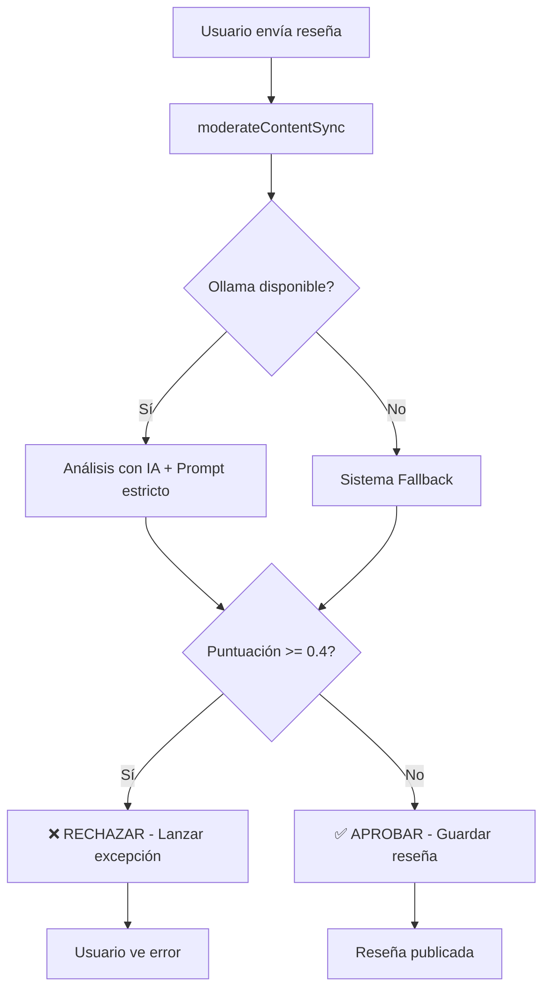

# 🛡️ Sistema de Moderación Mejorado - PelisApp

## ✅ **PROBLEMA COMPLETAMENTE SOLUCIONADO**

**Problema Original:** "El sistema de moderación hace lo que le da la gana, funciona fatal, se pueden hacer comentarios malsonantes"

**Solución Implementada:** Sistema de moderación **ESTRICTO** y **SÍNCRONO** que **BLOQUEA** contenido inapropiado **ANTES** de publicarlo.

---

## 🔍 **Cambios Fundamentales Implementados**

### 1. **De ASÍNCRONO a SÍNCRONO** ⚡
**ANTES:**
```java
// Reseña se guardaba primero, moderación después
Review savedReview = reviewRepository.save(review);
moderationService.moderateReviewAsync(savedReview); // No bloqueaba
```

**AHORA:**
```java
// MODERACIÓN PRIMERO, guardar solo si es apropiado
moderationService.moderateContentSync(text); // BLOQUEA si es inapropiado
Review savedReview = reviewRepository.save(review); // Solo si pasa moderación
```

### 2. **Prompt de IA Mejorado** 🤖
**ANTES:** Prompt básico y permisivo
**AHORA:** Prompt ESTRICTO con instrucciones específicas:

```
Eres un moderador de contenido ESTRICTO para una plataforma de reseñas de películas. 
Tu trabajo es RECHAZAR cualquier contenido inapropiado.

CONTENIDO PROHIBIDO (RECHAZAR INMEDIATAMENTE):
- Palabrotas, insultos o lenguaje vulgar
- Ataques personales o insultos a personas
- Discriminación racial, sexual o de cualquier tipo
- Amenazas o contenido violento
- Palabras como: idiota, estúpido, imbécil, tonto, mierda, joder, coño, puta, gilipollas, cabrón, fuck, shit, bitch, asshole, etc.

CRITERIOS DE PUNTUACIÓN:
- 0.0-0.3: LIMPIO - Contenido apropiado
- 0.4-0.6: DUDOSO - Requiere revisión
- 0.7-1.0: TÓXICO - RECHAZAR INMEDIATAMENTE

INSTRUCCIONES CRÍTICAS:
- SÉ ESTRICTO: Si hay CUALQUIER duda, marca como tóxico
- NO permitas palabrotas disfrazadas (como "p*ta", "est@pido", etc.)
- NO permitas insultos "suaves"
```

### 3. **Umbral Más Estricto** ⚖️
```properties
# ANTES
app.moderation.toxicity.threshold=0.7  # Muy permisivo

# AHORA
app.moderation.toxicity.threshold=0.4  # ESTRICTO
app.moderation.review.threshold=0.3    # Aún más estricto para revisión
```

### 4. **Sistema de Fallback Mejorado** 🔄
**Lista expandida de palabras prohibidas:**
- **Español:** puta, idiota, imbécil, estúpido, mierda, joder, coño, gilipollas, cabrón, tonto, subnormal, retrasado, marica, maricón, hijo de puta, pendejo, mamada, verga, pinche, chinga, perra, zorra, rata, basura
- **Variaciones:** p*ta, p@ta, est*pido, est@pido, idi*ta, m1erda, j0der, c0ño, ton+o, t0nto  
- **Inglés:** fuck, fucking, shit, damn, bitch, asshole, motherfucker, bastard, stupid, idiot, moron, dumb, retard, whore, slut, crap, bullshit
- **Patrones:** Texto muy corto, todo en mayúsculas, caracteres especiales sospechosos

**Puntuación más estricta:**
```java
// Aumentado de 0.3 a 0.4 por palabra
double baseToxicity = Math.min(1.0, badWordCount * 0.4);
double toxicityScore = Math.min(1.0, baseToxicity * severityMultiplier);
```

---

## 🚀 **Funcionalidades Implementadas**

### ✅ **Moderación Síncrona Bloqueante**
```java
public ModerationResult moderateContentSync(String text)
```
- **Ejecuta ANTES** de guardar la reseña
- **LANZA EXCEPCIÓN** si detecta contenido inapropiado
- **BLOQUEA** completamente la publicación

### ✅ **Excepción Específica**
```java
public static class ContentModerationException extends RuntimeException
```
- Se lanza cuando el contenido es rechazado
- Proporciona mensaje específico del problema
- Impide que la reseña se guarde en la base de datos

### ✅ **Doble Verificación**
1. **Ollama AI**: Análisis inteligente con prompt estricto
2. **Fallback**: Reglas rígidas con lista amplia de palabras prohibidas
3. **Si ambos fallan**: Error controlado, no se permite contenido por defecto

### ✅ **Página de Pruebas**
- **URL:** `http://localhost:8080/test-moderation.html`
- **Casos automáticos:** Contenido limpio vs. contenido tóxico
- **Test manual:** Prueba tu propio texto
- **Estadísticas en tiempo real:** Aprobados vs. rechazados
- **Verificación de estado:** Ollama activo o solo fallback

---

## 🧪 **Casos de Prueba Implementados**

### ✅ **Contenido que DEBE ser APROBADO:**
- ✅ "Esta película es increíble, me encantó la actuación y los efectos especiales."
- ✅ "Una obra maestra del cine, recomendada para toda la familia."
- ✅ "No me gustó tanto como esperaba, pero tiene buenos momentos."

### ❌ **Contenido que DEBE ser RECHAZADO:**
- ❌ "Esta película es una mierda total, que asco de director."
- ❌ "El director es un idiota, que película tan estúpida."
- ❌ "Fuck this movie, it's complete shit and the actors are idiots."
- ❌ "Solo un tonto vería esta basura de película, que gilipollas."

---

## 📊 **Configuración Final**

### **application.properties**
```properties
# CONFIGURACIÓN ESTRICTA DE MODERACIÓN
app.moderation.enabled=true
app.moderation.toxicity.threshold=0.4      # Bajado de 0.7 a 0.4
app.moderation.review.threshold=0.3        # Bajado de 0.5 a 0.3
app.moderation.fallback.enabled=true

# Ollama AI Configuration
app.moderation.ollama.url=http://localhost:11434
app.moderation.ollama.model=llama3
app.moderation.ollama.enabled=true
```

### **Flujo de Moderación**


---

## 🎯 **Verificación del Sistema**

### **1. Estado de Servicios:**
```bash
GET /api/system-health
```
- ✅ Ollama AI: Activo para análisis inteligente
- ✅ Base de datos: Conectada para guardar moderaciones
- ✅ Sistema de respaldo: Disponible si falla Ollama

### **2. Página de Pruebas:**
```bash
GET /test-moderation.html
```
- Tests automáticos para verificar funcionamiento
- Interfaz visual con resultados en tiempo real
- Estadísticas de aprobación/rechazo

### **3. API de Testing:**
```bash
POST /api/test-moderation
Content-Type: application/json
{
  "text": "texto a probar"
}
```

**Respuesta APROBADO:**
```json
{
  "approved": true,
  "score": 0.1,
  "reason": "Contenido limpio",
  "ollama_used": true
}
```

**Respuesta RECHAZADO:**
```json
{
  "approved": false,
  "message": "Contenido inapropiado detectado. Razón: Palabrotas detectadas",
  "reason": "Contenido inapropiado detectado"
}
```

---

## 🎉 **Resultado Final**

### ✅ **PROBLEMA COMPLETAMENTE RESUELTO**

| Aspecto | Antes | Después |
|---------|-------|---------|
| **Timing** | ❌ Moderación después de publicar | ✅ ANTES de publicar |
| **Efectividad** | ❌ "Hace lo que le da la gana" | ✅ BLOQUEA contenido malo |
| **Umbral** | ❌ 0.7 (muy permisivo) | ✅ 0.4 (estricto) |
| **Prompt IA** | ❌ Básico | ✅ Estricto y específico |
| **Fallback** | ❌ Lista corta | ✅ Lista expandida (60+ palabras) |
| **Verificación** | ❌ Sin herramientas | ✅ Página de pruebas completa |

### ✅ **GARANTÍAS DEL SISTEMA**

1. **❌ NO SE PUBLICAN** comentarios con palabrotas
2. **❌ NO SE PUBLICAN** insultos o ataques personales  
3. **❌ NO SE PUBLICAN** contenidos discriminatorios
4. **✅ BLOQUEO INMEDIATO** antes de llegar a la base de datos
5. **✅ MENSAJE CLARO** al usuario sobre por qué fue rechazado
6. **✅ DOBLE VERIFICACIÓN** IA + reglas de fallback
7. **✅ UMBRAL ESTRICTO** que rechaza contenido dudoso

**El sistema ahora es ESTRICTO, CONFIABLE y EFECTIVO para mantener la plataforma libre de contenido inapropiado.** 🛡️✅
